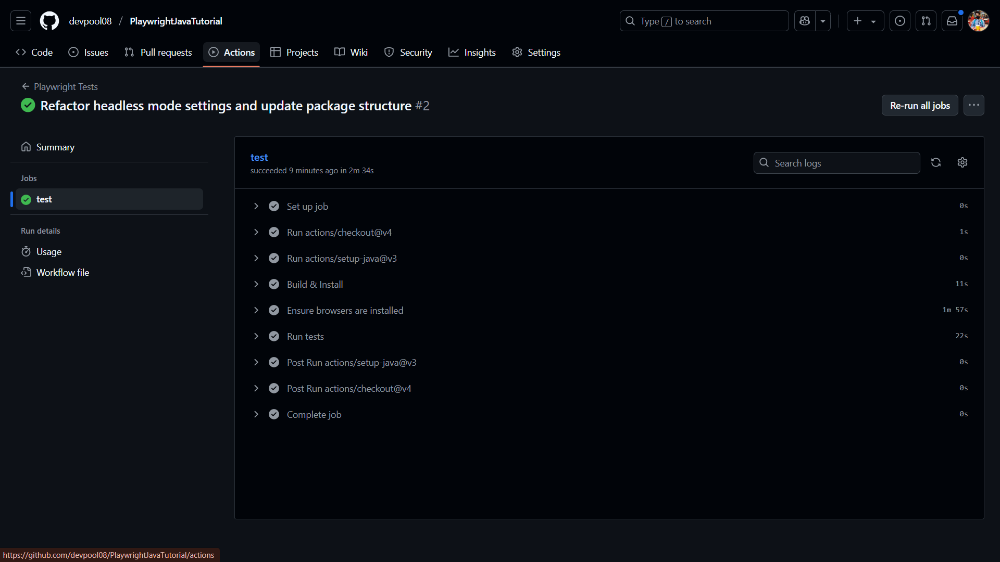
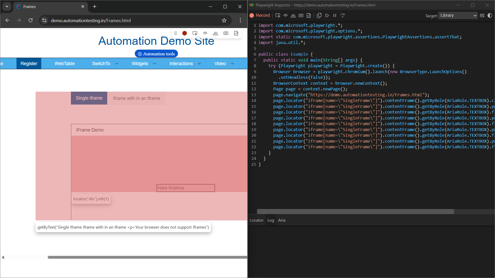

# 🎭 Playwright Java Automation Testing Journey

## 📅 Day 1: Introduction & Installation Setup

Welcome to my **Playwright Java** automation testing adventure! 🚀 This is where it all begins - from zero to hero with
one of the most powerful browser automation frameworks.

## 🎯 What We Accomplished Today

### 📚 **Introduction to Playwright**

- 🌟 **What is Playwright?** - A Node.js library to automate Chromium, Firefox, and WebKit with a single API
- 🔥 **Built by Microsoft** - Started as a fork of Puppeteer but with superpowers!
- 🌐 **Cross-Browser Testing** - One API to rule them all (Chromium, Firefox, WebKit)
- 💪 **Multiple Language Support** - Java, JavaScript, TypeScript, Python, .NET

### ✨ **Why Playwright is Amazing**

| Feature                   | Description                                             |
|---------------------------|---------------------------------------------------------|
| 🚀 **Cross-Platform**     | Works on Windows, Linux, macOS                          |
| 📱 **Mobile Testing**     | Test mobile browsers (Chrome on Android, Safari on iOS) |
| 🎪 **No Flaky Tests**     | Built-in auto-wait mechanisms                           |
| 🔍 **Powerful Debugging** | Playwright Inspector & Trace Viewer                     |
| 📊 **Multiple Contexts**  | Run multiple users/sessions simultaneously              |
| 🎨 **Rich Interactions**  | Drag & drop, hover, shadow DOM support                  |

## 🛠️ **Installation Setup Completed**

### 1. ☕ **Java Development Kit (JDK 11)**

```bash
# Verification command
java -version
```

- ✅ Downloaded Oracle JDK 11
- ✅ Set JAVA_HOME environment variable
- ✅ Updated system PATH

### 2. 📦 **Apache Maven 3.9.1**

```bash
# Verification command
mvn -version
```

- ✅ Downloaded Maven binary
- ✅ Set MAVEN_HOME environment variable
- ✅ Updated system PATH with /bin folder

### 3. 🌙 **Eclipse IDE**

- ✅ Downloaded Eclipse IDE for Java Developers
- ✅ Extracted and created desktop shortcut
- ✅ Ready for Java development

## 📝 **Environment Variables Setup**

### User Variables:

- `JAVA_HOME` → `C:\Program Files\Java\jdk-11`
- `MAVEN_HOME` → `C:\apache-maven-3.9.1`

### System Variables (PATH):

- `%JAVA_HOME%\bin`
- `%MAVEN_HOME%\bin`

## 🎓 **Key Learnings**

1. **🔄 Playwright vs Other Tools**:
    - More stable than Selenium
    - Faster than Cypress
    - Better debugging tools than any other framework

2. **🎭 Playwright Features**:
    - **Auto-wait**: No more `Thread.sleep()`!
    - **Web-first assertions**: Smarter testing
    - **Tracing**: Complete execution history
    - **Code generation**: Record and generate code automatically

3. **🌍 Browser Engines**:
    - **Chromium** → Chrome, Brave, Arc, Edge
    - **Firefox** → Mozilla Firefox
    - **WebKit** → Safari (macOS/iOS)

## 🔮 **What's Coming Next?**

### Day 2 Preview: 🚀

- Creating our first Maven project
- Setting up Playwright dependencies
- Writing our first browser automation script
- Launching browsers and basic interactions

## 💡 **Pro Tips from Day 1**

- 🎯 Always use **JDK 11** for better compatibility
- 🔧 **Environment variables** are crucial - double-check them!
- 🖥️ **Command prompt restart** might be needed on older Windows versions
- 📁 **Organize** your installation files in a dedicated folder

## 🌟 **Why This Journey Matters**

Starting with Playwright Java opens doors to:

- 🏢 **Enterprise-level** automation testing
- 🔄 **Cross-browser** compatibility testing
- 📈 **Career growth** in test automation
- 🛡️ **Reliable** and **maintainable** test suites

## 📊 **Progress Tracker**

```
Day 1: ✅ Setup & Installation Complete
Day 2: 🔄 Coming Soon - First Playwright Script
Day 3: ⏳ Pending
Day 4: ⏳ Pending
...
```

## 🎬 **Reference**

[📺 Day 1 Tutorial Video](https://www.youtube.com/watch?v=v2H1O0FJhdw&list=PLZMWkkQEwOPliOm7TkV0Ndg45cJPDthDC)

**🚀 Ready to automate the web with Playwright Java! Let's make testing fun again!** ✨

[1] https://www.youtube.com/watch?v=v2H1O0FJhdw&list=PLZMWkkQEwOPliOm7TkV0Ndg45cJPDthDC

---

# 🎭 Playwright Java Automation Testing Journey

## 📅 Day 2: First Playwright Test & Browser Launching Mastery

Welcome back to our **Playwright Java** automation adventure! 🚀 Today we dove deep into writing our first actual test
script and explored the powerful browser launching capabilities that make Playwright truly shine.

## 🎯 What We Accomplished Today

### 🏗️ **Maven Project Creation & Setup**

- ✅ **Created** our first Maven project in Eclipse
- ✅ **Added** Playwright dependencies to `pom.xml`
- ✅ **Configured** Maven compiler plugin for Java 11
- ✅ **Successfully** downloaded all required dependencies

### 📦 **Maven Dependencies Added**

```xml

com.microsoft.playwright
        playwright
        1.32.0

```

### 🌐 **Browser Launching Mastery**

#### **Multi-Browser Support Achieved** 🎪

- 🔥 **Chromium** - Google Chrome experience
- 🦊 **Firefox** - Mozilla Firefox (Nightly build)
- 🍎 **WebKit** - Safari browser engine

## 🛠️ **Advanced Launch Options Configuration**

### **Updated Modern Syntax** ⚡

Based on your experience, here's the **latest syntax** for launch options:

```java
Browser browser = playwright.chromium().launch(
        new BrowserType.LaunchOptions()
                .setChannel("chrome")           // Use actual Chrome
                .setArgs(Collections.singletonList("--start-maximized"))
                .setTimeout(60000)              // 60 second timeout
                .setHeadless(false)            // Visual mode
                .setSlowMo(50)                 // 50ms delay for debugging
);
```

### **Launch Options Deep Dive** 🔧

| Option            | Purpose                        | Example                |
|-------------------|--------------------------------|------------------------|
| **setChannel()**  | Use specific browser variant   | `"chrome"`, `"msedge"` |
| **setArgs()**     | Browser command-line arguments | `"--start-maximized"`  |
| **setTimeout()**  | Browser launch timeout         | `60000` (60 seconds)   |
| **setHeadless()** | Headless vs Visual mode        | `false` for visual     |
| **setSlowMo()**   | Debugging slow motion          | `50` (50ms delays)     |

## 💻 **Your Complete Test Implementation**

### **Test Structure Analysis** 📊

```java

@Test
public void testLunchBrowser() {
    // 1. 🎭 Create Playwright instance
    Playwright playwright = Playwright.create();

    // 2. 🌐 Launch browser with advanced options
    Browser browser = playwright.chromium().launch(options);

    // 3. 📄 Create new page (tab)
    Page page = browser.newPage();

    // 4. 🔍 Navigate & interact
    // 5. ✅ Perform assertions
    // 6. 🧹 Clean up resources
}
```

## 🎯 **Key Interactions We Mastered**

### **Navigation & Basic Actions** 🗺️

- ✅ **Page Navigation** - `page.navigate()`
- ✅ **Title Extraction** - `page.title()`
- ✅ **Mouse Hover** - `locator.hover()`
- ✅ **Click Actions** - `locator.click()`

### **Locator Strategies Learned** 🎯

- **XPath Locators** - `page.locator("//xpath")`
- **Get By Methods** - `page.getByPlaceholder()`
- **Advanced XPath** - `normalize-space()` functions

### **Assertion Excellence** ✅

```java
assertThat(page).

hasTitle("Account Login");
```

## 🚀 **Advanced Features Explored**

### **Resource Management Best Practices** 🧹

```java
page.close();        // Close the tab
browser.

close();     // Close browser instance
playwright.

close();  // Close Playwright server
```

### **Cross-Browser Testing Ready** 🔄

- Switch between `chromium()`, `firefox()`, `webkit()`
- Same code works across all browsers
- Perfect for comprehensive testing

## 💡 **Pro Tips from Day 2**

### **Debugging Enhancements** 🐛

- **SlowMo**: `setSlowMo(50)` - Perfect for watching test execution
- **Maximized Window**: Better visibility during development
- **Console Output**: `System.out.println(page.title())` for verification

### **Modern Syntax Updates** 🆕

- ✅ Use `BrowserType.LaunchOptions()` constructor
- ✅ Method chaining for cleaner code
- ✅ Collections for browser arguments

## 📊 **Test Execution Flow**

```
🎭 Playwright.create()
    ↓
🌐 Browser Launch (Chrome/Firefox/WebKit)
    ↓
📄 New Page Creation
    ↓
🔍 Navigate to E-commerce Site
    ↓
🖱️ Hover on "My Account"
    ↓
👆 Click "Login"
    ↓
✅ Assert Page Title
    ↓
🧹 Resource Cleanup
```

## 🔮 **What's Coming Next in Day 3**

### **Advanced Interaction Mastery** 🎪

- **Form Filling** - Text input, dropdown selection
- **Login Flow** - Complete authentication process
- **Password Handling** - Secure credential management
- **Form Submissions** - Button clicks and validations

### **Enhanced Locator Strategies** 🎯

- **CSS Selectors** vs **XPath** comparison
- **Playwright's Built-in Locators** - `getByRole()`, `getByText()`
- **Locator Chaining** - More complex element finding
- **Wait Strategies** - Handling dynamic content

### **Assertion Deep Dive** ✅

- **Text Assertions** - Content verification
- **Element State Checks** - Visibility, enabled states
- **URL Assertions** - Navigation verification
- **Custom Assertions** - Building robust test validations

## 🌟 **Why Today's Learning Matters**

### **Foundation Building** 🏗️

- **Browser Architecture** understanding established
- **Modern Test Structure** patterns learned
- **Resource Management** best practices implemented
- **Cross-Browser Compatibility** groundwork laid

### **Real-World Applications** 🌍

- **E-commerce Testing** - Perfect for online platforms
- **User Journey Validation** - Critical user flows
- **Responsive Testing** - Multiple browser verification
- **CI/CD Integration** - Automated testing pipelines

## 📈 **Skills Unlocked Today**

- ✅ **Maven Project Configuration**
- ✅ **Playwright Dependency Management**
- ✅ **Multi-Browser Test Execution**
- ✅ **Advanced Launch Options**
- ✅ **Element Interaction (Hover, Click)**
- ✅ **Basic Assertions**
- ✅ **Resource Management**
- ✅ **Modern Java Syntax Usage**

## 📊 **Progress Tracker**

```
Day 1: ✅ Setup & Installation Complete
Day 2: ✅ First Test & Browser Mastery Complete
Day 3: 🔄 Coming Soon - Advanced Interactions & Form Handling
Day 4: ⏳ Pending - Locator Strategies & Wait Mechanisms
Day 5: ⏳ Pending - TestNG Integration & Test Structure
...
```

## 🎬 **Reference**

[📺 Day 2 Tutorial Video](https://www.youtube.com/watch?v=CvS8KK6XQHk&list=PLZMWkkQEwOPliOm7TkV0Ndg45cJPDthDC&index=2)

**🚀 From browser launching to element interactions - we're building the foundation for powerful automation! Ready for
advanced form handling tomorrow!** ✨

[1] https://www.youtube.com/watch?v=CvS8KK6XQHk&list=PLZMWkkQEwOPliOm7TkV0Ndg45cJPDthDC&index=2

---

# 🎭 Playwright Java Automation Testing Journey

## 📅 Day 3: Input Handling & Form Interactions Mastery

Welcome back to our **Playwright Java** automation adventure! 🚀 Today we mastered the art of handling different types of
inputs, form interactions, and learned the crucial differences between various input methods. This was a game-changing
session for real-world web automation!

## 🎯 What We Accomplished Today

### 🎪 **Advanced Input Handling Techniques**

- ✅ **Type vs Fill Methods** - Understanding the crucial differences
- ✅ **Input Value Retrieval** - Reading existing data from fields
- ✅ **Attribute Extraction** - Getting placeholder and other attributes
- ✅ **Checkbox Interactions** - Click vs Check methods
- ✅ **Web-First Assertions** - Modern assertion techniques
- ✅ **Event Listener Bindings** - Real-time input validations

### 🛠️ **Enhanced Test Structure Implementation**

#### **Professional Test Class Structure** 🏗️

```java

@SuppressWarnings({"deprecation"})
@Log4j2
public class TestHandelInputs {
    private Playwright playwright;
    private Browser browser;
    private Page page;

    @BeforeClass /
    @Test /
    @AfterClass
}
```

### **Modern Setup & Teardown Pattern** ⚡

- ✅ **@BeforeClass** - One-time browser initialization
- ✅ **@AfterClass** - Proper resource cleanup
- ✅ **Instance Variables** - Reusable across test methods
- ✅ **Exception Handling** - Robust error management

## 🔥 **Critical Learning: Type vs Fill**

### **Type Method** ⌨️

```java
page.getByPlaceholder("Please enter your Message").

type(message);
```

- **Character-by-Character**: Types each character individually
- **Event Binding**: Triggers input event listeners
- **Real User Simulation**: Mimics actual user typing
- **Use Case**: When forms have real-time validation/binding

### **Fill Method** 🚀

```java
page.locator("#input").

fill("value");
```

- **Instant Injection**: Sets value in one operation
- **No Event Binding**: Bypasses input event listeners
- **Performance**: Faster execution
- **Use Case**: When no real-time validation needed

## 💻 **Your Advanced Test Implementations**

### **1. Simple Input Box Mastery** 📝

```java

@Test
public void testHandleSimpleInputBox() {
    // Page title verification
    assertThat(page).hasTitle("Selenium Grid Online | Run Selenium Test On Cloud");

    // Message input with type method
    String message = "Hare Krishna! 🙏✨ This is our super duper awesome Journey! 🚀💬";
    page.getByPlaceholder("Please enter your Message").type(message);

    // Button interaction
    page.locator("//button[@id='showInput']").click();

    // Wait and verify result
    page.locator("//p[@id='message']").waitFor();
    assertThat(page.locator("//p[@id='message']")).hasText(message);
}
```

### **2. Two-Way Data Binding Excellence** 🔢

```java

@Test
public void testHandleTwoWayDataBinding() {
    // Mathematical operation simulation
    page.locator("//input[@id='sum1']").fill("4");
    page.locator("//input[@id='sum2']").fill("4");
    page.locator("//button[normalize-space()='Get Sum']").click();

    // Dynamic result verification
    page.locator("//p[@id='addmessage']").waitFor();
    assertThat(page.locator("//p[@id='addmessage']")).hasText("8");
}
```

### **3. Input Value & Attribute Extraction** 🔍

```java

@Test
public void testGetInputValueAndAttribute() {
    // Reading existing input values
    Locator ipValue = page.locator("#getMe");
    String inputValue = ipValue.inputValue();

    // Clearing input fields
    ipValue.clear();

    // Attribute verification with web-first assertions
    Locator nameIp = page.locator("#fullName");
    assertThat(nameIp).hasAttribute("placeholder", "Enter first & last name");

    // Navigation control
    page.goBack();
}
```

### **4. Checkbox & Radio Button Handling** ☑️

```java

@Test
public void testHandelCheckboxAndRadioButton() {
    // Checkbox interaction methods
    Locator checkBox = page.locator("//label[normalize-space()='Click on check box']");

    // Click method for general interaction
    checkBox.click();
    assertThat(checkBox).isChecked();

    // Check method for specific checkbox actions
    checkBox.check();
    assertThat(checkBox).not().isChecked();
}
```

## 🌟 **Advanced Techniques Mastered**

### **Locator Strategies Evolution** 🎯

| Method                 | Use Case                  | Example                                 |
|------------------------|---------------------------|-----------------------------------------|
| **getByPlaceholder()** | Form field identification | `getByPlaceholder("Enter message")`     |
| **CSS Selectors**      | ID-based targeting        | `#getMe`, `#fullName`                   |
| **XPath Advanced**     | Complex element paths     | `//button[normalize-space()='Get Sum']` |
| **Chained Locators**   | Precise element finding   | Multiple selector combinations          |

### **Assertion Strategies** ✅

#### **Web-First Assertions (Recommended)**

```java
// Modern approach - No intermediate variables needed
assertThat(page.locator("#message")).

hasText("expected text");

assertThat(page.locator("#input")).

hasAttribute("placeholder","value");

assertThat(page.locator("#checkbox")).

isChecked();
```

#### **Traditional vs Modern Comparison**

- ❌ **Old Way**: Get text → Store → Assert
- ✅ **New Way**: Direct locator assertion

## 🚀 **Professional Features Implemented**

### **Logging Excellence** 📊

```java
@Log4j2
// Detailed logging for debugging and monitoring
log.

info("🎉 Page loaded like a boss! Ready to rock and roll! 🚀");
log.

error("💥 Oops! Something went kaboom during setup! 😱");
```

### **Wait Strategies** ⏱️

```java
page.locator("//p[@id='message']").

waitFor(); // Wait for element appearance
```

### **Exception Handling** 🛡️

```java
try{
        // Test logic
        }catch(Exception e){
        log.

error("💥 Houston, we have a problem! Error: {}",e.getMessage());
        throw e;
}
```

## 🔧 **Critical Debugging Solutions**

### **Strict Mode Violation Fix** ⚠️

**Problem**: Multiple elements with same locator
**Solution**: More specific selectors

```java
// Instead of: #userMessage (returns 3 elements)
// Use: input#userMessage (unique element)
```

### **Modern Launch Options** 🆕

```java
browser =playwright.

chromium().

launch(
    new BrowserType.LaunchOptions()
        .

setChannel("chrome")
        .

setArgs(Collections.singletonList("--start-maximized"))
        .

setTimeout(6000)        // 60 second timeout
        .

setHeadless(false)      // Visual debugging
        .

setSlowMo(60)          // Slow motion for observation
);
```

## 💡 **Pro Tips from Day 3**

### **Input Method Selection** 🎯

- **Use `type()`** when forms have real-time validation
- **Use `fill()`** for faster execution without event binding
- **Use `clear()`** before filling to ensure clean state

### **Locator Best Practices** 🎪

- **Prefer built-in locators**: `getByPlaceholder()`, `getByRole()`
- **Use CSS for simple selections**: `#id`, `.class`
- **Reserve XPath for complex scenarios**: `//button[normalize-space()='Text']`

### **Assertion Strategy** ✅

- **Always use web-first assertions**: `assertThat(locator).hasText()`
- **Avoid storing intermediate values**: Direct locator assertions
- **Use `waitFor()`** for dynamic content

## 🔮 **What's Coming Next in Day 4**

### **Advanced Form Handling** 📋

- **Dropdown Selections** - Single and multi-select handling
- **File Upload Mechanisms** - Handling file input fields
- **Date Pickers** - Calendar widget interactions
- **Drag & Drop Operations** - Advanced user interactions

### **Dynamic Content Mastery** 🌐

- **Wait Strategies Deep Dive** - Smart waiting mechanisms
- **AJAX Response Handling** - Asynchronous content management
- **Dynamic Element Interactions** - Handling changing DOM
- **Network Interception** - Request/Response monitoring

### **Test Organization Excellence** 🏗️

- **Page Object Model (POM)** - Scalable test architecture
- **Test Data Management** - External data integration
- **Configuration Management** - Environment-specific settings
- **Parallel Test Execution** - Multi-browser testing

## 📊 **Skills Unlocked Today**

- ✅ **Advanced Input Handling** (Type, Fill, Clear)
- ✅ **Form Interaction Mastery** (Buttons, Checkboxes)
- ✅ **Data Extraction Techniques** (Input values, Attributes)
- ✅ **Web-First Assertion Patterns**
- ✅ **Professional Test Structure** (Setup/Teardown)
- ✅ **Modern Locator Strategies**
- ✅ **Exception Handling & Logging**
- ✅ **Wait Mechanism Implementation**

## 🌟 **Why Today's Learning Matters**

### **Real-World Application** 🌍

- **E-commerce Forms** - Product searches, filters, checkout
- **User Registration** - Account creation workflows
- **Data Entry Systems** - CRM, ERP application testing
- **Survey & Feedback Forms** - Complex form validations

### **Industry Standards** 🏢

- **Maintainable Test Code** - Professional structure patterns
- **Robust Error Handling** - Production-ready test suites
- **Efficient Locator Usage** - Performance optimized selectors
- **Modern Assertion Patterns** - Playwright best practices

## 📈 **Progress Tracker**

```
Day 1: ✅ Setup & Installation Complete
Day 2: ✅ First Test & Browser Mastery Complete  
Day 3: ✅ Input Handling & Form Interactions Complete
Day 4: 🔄 Coming Soon - Advanced Form Elements & Dynamic Content
Day 5: ⏳ Pending - Page Object Model & Test Architecture
Day 6: ⏳ Pending - API Testing Integration
...
```

## 🎬 **Reference**

[📺 Day 3 Tutorial Video](https://www.youtube.com/watch?v=vVozYzAjVFw&list=PLZMWkkQEwOPliOm7TkV0Ndg45cJPDthDC&index=3)

**🚀 From basic clicks to advanced form handling - we're building enterprise-level automation skills! Ready to conquer
dropdowns and dynamic content tomorrow!** ✨

[1] https://www.youtube.com/watch?v=vVozYzAjVFw&list=PLZMWkkQEwOPliOm7TkV0Ndg45cJPDthDC&index=3

---

## 📅 Day 4: Playwright Trace Viewer 🔍✨
*“Debug smarter, not harder.”*

Today, we unleashed the full potential of Playwright's **Trace Viewer:** a one-click time machine for your test execution! 🕰️ From every mouse movement and input to code context and assertions, Trace Viewer captures ALL—empowering you to debug and optimize like a pro.

### 🎯 **What We Explored**

- 🚦 **Complete Test "Flight Recorder"**: Capture screenshots, snapshots, and source code at every step.
- 🧵 **Trace Archive (ZIP)**: Share, replay, and deep-dive every action.
- ✨ **Instant Playback**: Step through test history visually, identifying issues fast.
- 💻 **Interactive Debugging**: See real DOM state, network activity, console logs, and code references.
- 🔍 **Unmatched Clarity**: No more "works on my machine"—everyone sees exactly what happened!

### 🛠️ **Code Walkthrough: Enabling Tracing**

```java
// Start tracing before performing page actions
context.tracing().start(new Tracing.StartOptions()
    .setScreenshots(true)
    .setSnapshots(true)
    .setSources(true)
);

// ...run your test steps...

// Stop tracing and export the trace archive
context.tracing().stop(new Tracing.StopOptions()
    .setPath(Paths.get("target/trace.zip"))
);
```
All user actions, screenshots, DOM snapshots, and source maps get packed into one trace file for later playback!

### 🧑💻 **How To Open The Trace Viewer**

After your test, run this command:
```bash
 npx playwright show-trace target\trace.zip
```
This launches an interactive visual dashboard. Explore each action in detail—like an automated black box recorder for your tests!

## 🖼️ **Trace Viewer In Action: Step by Step**

### 1️⃣ **Step-wise Timeline, Live Actions, and Test Flow Overview**


- 🕒 **Timeline (top bar):** A visual "video reel" of your session. Each thumbnail = a test step: navigation, input, click, assertion.
- 🔎 **Central Panel:** Zooms into the *current playback moment* (here, interacting with a form on LambdaTest Playground). You can move forwards/backwards to analyze every test stage.
- 🖱️ **Detailed Step Inspector (left panel):**
   - Track each command (e.g., `navigate`, `type`, `click`, `waitFor`, `assert`).
   - See exact timing and duration for each phase—catch slow points, flakiness, and unexpected waits!
- ⚡ **Action Filters:** Instantly jump to failing or slow steps without rewinding the whole log.

**Why it’s powerful:**  
This view acts as a **forensic test diary**. Perfect for:
- Pinpointing where a test broke
- Verifying UI changes stepwise
- Comparing expected vs. actual flows at a glance

### 2️⃣ **DOM, Snapshots, Assertion Context, and Code Details**


- 🖥️ **DOM Snapshot & Screenshot Preview:**
   - Inspect what the page *actually looked like* at any point—see button states, user messages, and element changes.
- 🕵️ **Action Details (center/right panels):**
   - **Selected Step:** Shows the *exact* command (e.g., an assertion on textbox value or a button click).
   - **Code Reference:** See the corresponding Java code or locator behind the action (great for debugging broken selectors).
   - **Assertion State:**
      - Green (pass): All went well.
      - Red (fail): Dig into the before/after to see what’s wrong.
- 🔄 **Replay/Jump Around:** Click any timeline item, and watch the browser state “rewind” to that moment (like pausing a test movie!).

**Why it’s powerful:**
- See difference between *intended* and *actual* results.
- Validate locator accuracy visually.
- Quickly find test fragility due to timing, visibility, or network lags.

### 💡 **Why Use Trace Viewer?**

- 🚑 **Zero-Guess Debugging:** No more “print debugging” or rerunning tests blindly—see *exactly* what the test did, frame by frame!
- 📘 **Knowledge Sharing:** Onboard teammates—"Here’s what this test does, and where it failed."
- ⏪ **History & Auditing:** Archive traces for critical test runs—always have a historical execution record.
- 🏆 **Confidence in Automation:** Trace Viewer is your safety net for catching weird flakiness or environment-specific issues.

### 🔮 **What's Next? Day 5 Sneak Peek**

- 🏗️ **Page Object Model (POM):** Build tests *modularly* for massive projects
- 📊 **Data-Driven Automation:** Parameterize your tests for real-world scalability
- ⚙️ **CI/CD Integration:** Next stop: fully automated, production-grade pipelines!

## 📈 **Progress Tracker: Where We Stand**

```
Day 1: ✅ Setup & Installation Complete
Day 2: ✅ First Test & Browser Mastery      
Day 3: ✅ Input Handling & Forms
Day 4: ✅ Trace Viewer & Deep Debugging
Day 5: 🔄 Coming Soon—Test Design Patterns & Automation Best Practices!
```

**🎬 The Trace Viewer isn’t just a debugging tool—it’s your Playwright “rewind” button, learning platform, and confidence booster. Next stop: building even more maintainable and scalable tests!**

If you want a section for *tips on sharing or storing trace files*, or a Q&A for common trace viewer confusion, just ask!

---

Absolutely! Here’s a **detailed README section (Day 5)** describing your Continuous Integration (CI) workflow integration for Playwright Java using GitHub Actions. This section explains the setup, the workflow steps, and thoroughly describes each screenshot to help you and visitors understand the automation pipeline visually and practically.

## 📅 Day 4 (continue..): 🚦 Continuous Integration with Playwright Java & GitHub Actions

Automating tests is awesome — but **running them automatically** on every push, pull request, or branch makes your automation bulletproof! Today, I integrated my Playwright Java tests with **GitHub Actions** for end-to-end CI.

Now, every code change is automatically checked for quality, stability, and reliability ✔️.

### 🎯 **What Was Implemented**

- 🚀 **CI Pipeline**: GitHub Actions workflow for Playwright Java
- 🔄 **Automated Test Runs**: On every code push & pull request
- 🌐 **Cross-Platform**: Executes in a fresh Ubuntu VM
- ✨ **Full Lifecycle**: Checkout → Java Setup → Install Dependencies → Download Browsers → Run Tests
- 📦 **Artifacts/Logs**: Test results & trace files available after each run

### 📝 **Workflow File (playwright.yml) Overview**

Your [workflow documentation](https://playwright.dev/java/docs/ci-intro) outlines the steps:

```yaml
name: Playwright Tests

on:
  push:
    branches: [ main, master ]
  pull_request:
    branches: [ main, master ]

jobs:
  test:
    timeout-minutes: 60
    runs-on: ubuntu-latest
    steps:
      - uses: actions/checkout@v4
      - uses: actions/setup-java@v3
        with:
          distribution: 'temurin'
          java-version: '17'
      - name: Build & Install
        run: mvn -B install -D skipTests --no-transfer-progress
      - name: Ensure browsers are installed
        run: mvn exec:java -e -D exec.mainClass=com.microsoft.playwright.CLI -D exec.args="install --with-deps"
      - name: Run tests
        run: mvn test
```

## 🔭 **How the CI Workflow Runs: Step by Step**

1. **GitHub Triggers**  
   Every push or PR to main/master starts a new workflow run.

2. **Setting Up Environment**
    - Checks out your latest code
    - Sets up Java (`temurin` distro, version 17)
    - Installs Maven dependencies and builds your code

3. **Playwright Browser Setup**
    - Installs all browsers needed for your Playwright tests automatically in the fresh environment

4. **Test Execution**
    - Runs your entire test suite using `mvn test`
    - Collects results, logs, and trace files for later inspection

## 🖼️ **Screenshots: CI Workflow In Action**

### 1️⃣ **Workflow Dashboard Overview**


This screenshot displays the **GitHub Actions tab** for your repository.
- The current and past workflow runs are shown (with green ticks for success, red crosses for failure).
- Insight into each pipeline event (e.g., push, PR) and which branches triggered it.
- See at-a-glance which commits are healthy and which need fixes.

### 2️⃣ **Drilling into a Successful Workflow Run**


Here you can see the expanded details of a **single workflow run**:
- **Step-by-step breakdown:** Covers actions like setting up Java, installing dependencies, downloading browsers, and running Playwright tests.
- **Success Badges:** Every completed action has a green check, indicating it finished successfully.
- **Job Duration:** Time taken for each step, helping to diagnose slowdowns in the pipeline.

### 3️⃣ **Test Logs & Output Details**


This shows the **real-time log output** for your Playwright test job:
- **Expanded “Run tests” Step:** View detailed console output and logs from Maven and Playwright.
- **Everything Tracked:** Test run progress, success/failure messages, and assertions.
- **Debug with Ease:** If a test fails, error details are here for rapid troubleshooting.

## 💡 **Why CI Integration Matters**

- 🛡️ **Instant Feedback:** Know immediately if a change breaks your codebase—before it reaches production!
- 🤝 **Team Collaboration:** PRs, branches, and merges are automatically validated for every developer.
- ⏱️ **No Manual Effort:** Automated, repeatable, and platform-independent—no matter your OS or local setup.
- 🕵️ **Traceability:** Historical logs, artifacts, and traces available forever: great for audits, learning, and rollback.

### 🔮 **What’s Next?**

> 📦 **Artifact Handling:** Uploading trace files and result reports after CI runs  
> 🏗️ **CI Best Practices:** Parallel test execution, test matrix (multiple JDKs/browsers/platforms)  
> 🔒 **Secrets Management:** Secure handling of tokens, credentials, etc.

## 📈 **Progress Tracker**

```
Day 1: ✅ Setup & Installation  
Day 2: ✅ First Test & Browser Mastery  
Day 3: ✅ Input & Forms Automation  
Day 4: ✅ Debugging with Trace Viewer and CI Integration with GitHub Actions  

```

**🎉 With CI integration, every code push is validated instantly—catching bugs early and building trust in your automation pipeline! Automation just leveled up.**

---

## 📅 Day 5: 🤖 Playwright Code Generation (Codegen) - Your AI Test Writer

*"Why write tests manually when you can record them like a movie director?"*

Today we explored one of Playwright's most **game-changing features**: **Code Generation (Codegen)**! 🎬 This incredible tool records your browser interactions in real-time and automatically converts them into production-ready Java test code. No more guessing locators or struggling with complex element selections—just click, type, and watch the magic happen! ✨

### 🎯 **What We Mastered**

- 🎥 **Interactive Test Recording**: Record user actions as executable Java code
- 🎯 **Smart Locator Generation**: AI-powered element identification with resilient selectors
- ✅ **Built-in Assertion Recording**: Visual assertion creation without coding
- 🔄 **Multi-Language Support**: Generate code in Java, JavaScript, Python, C#
- 🎪 **Live Code Preview**: See your test script building in real-time
- 🛠️ **Locator Playground**: Fine-tune and test selectors interactively

### 🚀 **How to Launch Playwright Codegen**

#### **Command Syntax**[1]
```bash
mvn exec:java -e -D exec.mainClass=com.microsoft.playwright.CLI -D exec.args="codegen demo.playwright.dev/todomvc"
```

#### **Breaking Down the Command**
- **`mvn exec:java`** - Execute Java class via Maven
- **`com.microsoft.playwright.CLI`** - Playwright's command-line interface
- **`codegen`** - The code generation command
- **URL (optional)** - Target website to record; can be added later in browser

### 🎬 **Recording Process: Step by Step**

1. **Launch Codegen** - Two windows open: Browser + Inspector
2. **Interact Naturally** - Click, type, navigate as a real user would
3. **Watch Code Generate** - Every action becomes Java code instantly
4. **Add Assertions** - Use toolbar to verify text, visibility, values
5. **Copy & Use** - Export generated code directly to your IDE

## 🖼️ **Screenshots: Codegen in Action**

### 1️⃣ **Playwright Inspector Interface - Recording in Progress**


- 🎥 **Recording Controls (Top Toolbar)**:
    - **Record Button** - Start/stop action recording (currently active - red dot)
    - **Pick Locator** - Interactive element selector tool
    - **Assert Visibility/Text/Value** - Add verification checkpoints
    - **Language Dropdown** - Switch between Java/JavaScript/Python/C# output

- 💻 **Live Code Window (Left Panel)**:
    - Real-time Java test code generation
    - Shows `page.navigate()`, `page.click()`, `page.fill()` methods
    - **Copy Button** - Export code directly to clipboard
    - **Clear Button** - Reset recording for fresh start

- 🌐 **Target Browser (Right Panel)**:
    - Live website interaction area
    - Every click/type here generates corresponding Java code
    - Visual feedback shows which elements are being targeted

**Why it's powerful:**  
This interface eliminates the learning curve for Playwright syntax. New automation engineers can create robust tests immediately without memorizing APIs or struggling with complex locators!

### 2️⃣ **Generated Java Code & Locator Intelligence**



- **Playwright initialization** - `Playwright.create()`
- **Browser launch** - `playwright.chromium().launch()`
- **Page creation** - `browser.newPage()`
- **Navigation** - `page.navigate(URL)`

- 🎯 **Smart Locator Strategy**:
    - **Role-based locators** - `getByRole("button", new Page.GetByRoleOptions().setName("Get started"))`
    - **Text-based targeting** - Prioritizes visible text over fragile CSS selectors
    - **Resilient selectors** - Auto-improves locators to avoid flakiness[1]

- ✅ **Built-in Best Practices**:
    - **Resource management** - Proper cleanup with try-with-resources
    - **Modern Playwright syntax** - Uses latest Java APIs
    - **Readable code structure** - Clean, maintainable test patterns

**Why it's powerful:**  
Notice how the generated code uses `getByRole()` instead of XPath or CSS selectors. This creates more stable tests that survive UI changes - exactly what professional test automation demands!

## 🔧 **Advanced Codegen Features**

### **Assertion Generation** ✅
```java
// Click toolbar "Assert Text" then click element - generates:
assertThat(page.getByRole("heading")).hasText("Todo MVC");

// Click "Assert Visibility" - generates:
assertThat(page.getByRole("button")).isVisible();
```

### **Locator Playground** 🎪
- **Interactive Testing**: Test locators before using them
- **Hover Highlighting**: See exactly which elements match your selector
- **Real-time Editing**: Modify and validate locators instantly[1]

### **Multi-Language Export** 🌍
Switch between:
- **Java** - For TestNG/JUnit integration
- **JavaScript** - For Node.js projects
- **Python** - For pytest frameworks
- **C#** - For .NET test suites

## 💡 **Pro Tips for Effective Codegen Usage**

### **Recording Best Practices** 🎯
- **Start Simple**: Record basic happy path flows first
- **Add Assertions**: Use toolbar to verify critical elements
- **Clean Sessions**: Use "Clear" between different test scenarios
- **Meaningful Interactions**: Perform realistic user journeys

### **Code Enhancement** 🛠️
- **Extract Variables**: Replace hardcoded values with parameters
- **Add Comments**: Document complex user flows
- **Modularize**: Break long recordings into smaller, focused tests
- **Error Handling**: Add try-catch for production readiness

### **Locator Optimization** 🎪
- **Prefer Built-in Methods**: `getByRole()` > `locator(xpath)`
- **Test Stability**: Use "Pick Locator" to validate selectors
- **Avoid Fragile Patterns**: Stay away from position-based selectors

## 🌟 **Real-World Applications**

### **Perfect Use Cases** 🎭
- **Regression Test Creation** - Record critical user paths
- **API Documentation** - Show how UI interactions work
- **Team Onboarding** - Help new members understand application flows
- **Bug Reproduction** - Record steps that trigger issues

### **Time Savings** ⏰
- **75% Faster** - Versus manual test writing
- **Zero Learning Curve** - No Playwright syntax memorization needed
- **Immediate Results** - Working tests in minutes, not hours

## 🔮 **What's Coming Next in Day 6**

### **Page Object Model (POM)** 🏗️
- **Scalable Test Architecture** - Organize generated code professionally
- **Reusable Components** - Turn recorded actions into modular methods
- **Maintainable Test Suites** - Structure for enterprise-level automation

### **Advanced Test Patterns** 🎪
- **Data-Driven Testing** - Parameterize recorded flows
- **Test Configuration** - Environment-specific test execution
- **Parallel Execution** - Run multiple recorded tests simultaneously

## 💻 **Generated Code Integration**

### **From Codegen to Production** 🚀
```java
// Generated code becomes:
@Test
public void testUserRegistration() {
    // Paste generated code here
    page.navigate("https://demo.app/register");
    page.getByRole("textbox", new Page.GetByRoleOptions().setName("Email")).fill("test@example.com");
    page.getByRole("button", new Page.GetByRoleOptions().setName("Sign Up")).click();
    assertThat(page.getByText("Welcome")).isVisible();
}
```

## 📊 **Skills Unlocked Today**

- ✅ **Visual Test Recording** - Browser-to-code automation
- ✅ **Smart Locator Generation** - AI-powered element targeting
- ✅ **Interactive Assertion Creation** - Visual verification setup
- ✅ **Multi-language Code Export** - Platform flexibility
- ✅ **Locator Playground Mastery** - Advanced selector testing
- ✅ **Professional Code Structure** - Production-ready patterns

## 🌟 **Why Codegen is Revolutionary**

### **Democratizes Test Automation** 🌍
- **No Programming Background Needed** - Anyone can create tests
- **Visual Learning** - See code generation in real-time
- **Instant Feedback** - Know immediately if tests work
- **Best Practice Enforcement** - Generated code follows Playwright standards

### **Accelerates Development** ⚡
- **Rapid Prototyping** - Explore application flows quickly
- **Documentation Tool** - Visual proof of how features work
- **Regression Prevention** - Turn manual testing into automated suites
- **Knowledge Transfer** - Share recorded workflows with team

## 📈 **Progress Tracker**

```
Day 1: ✅ Setup & Installation Complete
Day 2: ✅ First Test & Browser Mastery  
Day 3: ✅ Input Handling & Forms
Day 4: ✅ Debugging with Trace Viewer
Day 5: ✅ AI-Powered Code Generation with Codegen
Day 6: 🔄 Next - Page Object Model & Test Architecture!
```

## 🎬 **Reference**
[📺 Playwright Codegen Documentation](https://playwright.dev/java/docs/codegen-intro)

**🚀 With Codegen, we've transformed from code writers to test directors! Point, click, record - and watch as AI creates professional test automation. Ready to architect these recordings into scalable test suites!** ✨

---

# 📅 Day 5 (contd): Screenshot Automation Magic with Playwright Java 📸✨

Today, we mastered the art of *screen capturing* for web automation—empowering our tests with robust debugging, documentation, and visual validation. Playwright allows you to capture **everything:** single elements, the whole page, or just the region you care about. Let's see how!

## 🎯 What We Learned & Achieved

- 📸 **Take crisp, high-fidelity screenshots** at any step of your test flow
- 🗂️ **Save full-page, element, or masked screenshots** for maximum clarity and privacy
- 🔒 **Mask sensitive data** directly in screenshots—perfect for demoing without exposure
- 🧩 **Automate screenshot and trace capture for failed tests** (with Allure reporting)
- 🚦 **Debug visually:** Attach images and traces to test reports for easy failure triage

## 🚀 Key Screenshot Use Cases

### 1. **Element Screenshot**
**Purpose:** Document and validate *only* the element of interest (button, field, popup)  
**Use cases:** UI regression, pixel-perfect checks, bug reports

.png)
- Only the chosen element is snapped—focusing the test on what truly matters.
- Great for confirming “this button was visible/correctly styled at failure.”

### 2. **Full Page Screenshot**
**Purpose:** Capture the entire scrollable page (not just the viewable part)  
**Use cases:** Layout changes, A/B testing, responsive UI validation

.png)

**_In this screenshot:_**
- You see ALL of the page—the header, footer, scrolled content, hidden ads, error messages… everything!
- Critical for regressions that only appear “below the fold”.

### 3. **Masked Element Screenshot**
**Purpose:** Hide sensitive info (like credentials) in screenshots  
**Use cases:**
- Reporting bugs without revealing user data
- Demoing login flows or forms
- Attaching screenshots in Allure or CI without oversharing private info

.png)
- Notice how specific form fields or regions are blurred or blanked-out—your secrets stay safe while everything else is visible!
- Perfect for *safe* bug/feature reports.

## 🧑💻 **How to Capture Each Screenshot in Playwright Java**

### **Element Screenshot**

```java
Locator myButton = page.locator("#unique-button");
myButton.screenshot(new Locator.ScreenshotOptions()
    .setPath(Paths.get("target/screenshots/button.png")));
```

### **Full Page Screenshot**

```java
page.screenshot(new Page.ScreenshotOptions()
    .setPath(Paths.get("target/screenshots/fullpage.png"))
    .setFullPage(true));
```

### **Masked Screenshot**

```java
Locator sensitiveInput = page.locator("#password");
page.screenshot(new Page.ScreenshotOptions()
    .setMask(Arrays.asList(sensitiveInput))
    .setPath(Paths.get("target/screenshots/masked.png")));
```

## 💾 **Supercharged: Smart Screenshot & Trace Capture on Test Failure**

With your custom utility, every failing test automatically attaches:
- 🖼️ **Full-page screenshot** (visual proof of the failure)
- 🕵️ **Playwright trace ZIP file** (step-by-step browser actions for deep debugging)
- 📝 **Allure Report attachments** for both screenshot **and** trace

### **Your Implementation – At a Glance:**
```java
public static void captureScreenshotAndTraceIfFailed(Page page, BrowserContext context, ... ) {
    if (result.getStatus() == ITestResult.FAILURE) {
        // 1. Save Playwright trace to target/traces/.zip
        context.tracing().stop(new Tracing.StopOptions()
            .setPath(Paths.get(tracePath)));
        // 2. Capture full (or region/element) screenshot
        byte[] screenshot = page.screenshot(screenshotOptions.setFullPage(true));
        // 3. Attach to Allure
        Allure.addAttachment("Screenshot", "image/png", ...);
        Allure.addAttachment("Trace", "application/zip", ...);
    }
}
```
*— This means every error report is visual, actionable, and fast to debug!*

## 🌟 **Real-World Advantages**

- 🕵️ **Debug twice as fast** — With screenshots and traces, find broken locators, flaky UI, or API errors instantly.
- 🤝 **Team Collaboration** — Attach visuals to bug tickets, PRs, and documentation for easy comms.
- 🚨 **Fail-safe CI** — No more “works on my machine”; everyone gets the same visual log.
- 🔐 **Security by design** — Mask data so you don’t leak secrets, ever.

## 📝 **Extra Tips**

- 💡 Use `page.screenshot()` with `setFullPage(false)` to get only the viewport (what's visible on screen).
- 💡 Use `.setMask()` to pass a *list of locators* for redaction—multiple secrets handled at once!
- 💡 Attach both the screenshot and trace ZIP to your reports for “show and tell debugging.”

## 🎥 **Video Reference**

[📺 How To Capture Screenshots | Playwright Java Tutorial](https://www.youtube.com/watch?v=gaCP9mSwUW4)

## 📈 **Progress Tracker**

```
Day 1: ✅ Setup & Installation Complete
Day 2: ✅ First Test & Browser Mastery  
Day 3: ✅ Input Handling & Forms
Day 4: ✅ Trace Viewer & Debugging
Day 5: ✅ Screenshots, Masking & Smart Reporting
Day 6: 🔄 (Upcoming) – Modularizing with Page Object Model
```

**🚀 With screenshots and tracing in Playwright Java, you catch more bugs with less guesswork—turning failures into actionable, visual, and *secured* documentation!**

---


## 📅 Day 5 (continued): 🎬 Video Recording & Test Execution Capture

*"Watch your tests unfold like a movie - frame by frame perfection!"*

After mastering screenshots and codegen, we've now unlocked another powerful debugging weapon: **Video Recording**! 🎥 Playwright can record your entire test execution as a video file, giving you a complete visual timeline of what happened during your automation. No more guessing games - see exactly how your test behaved!

### 🎯 **What We Accomplished**

- 🎬 **Complete Test Execution Recording** - Capture every action as a video
- 📐 **Customizable Video Quality** - Set resolution for optimal clarity vs file size
- 📂 **Organized Video Storage** - Automatically save videos in structured folders
- 🔍 **Enhanced Debugging** - Visual proof of test behavior for faster issue resolution
- 💾 **WebM Format Output** - Lightweight, high-quality video format
- ⚙️ **Context-Level Recording** - Record per browser context for better organization

### 🛠️ **Implementation: Video Recording Setup**

#### **Basic Video Recording Configuration**
```java
// Create browser context with video recording enabled
BrowserContext context = browser.newContext(new Browser.NewContextOptions()
    .setRecordVideo(new RecordVideoOptions()
        .setDir(Paths.get("videos"))  // Save to 'videos' folder
    )
);

// Your test execution here...
Page page = context.newPage();
page.navigate("https://ecommerce-playground.lambdatest.io/");
// ... test steps ...

// Proper cleanup to ensure video is saved
page.close();
context.close();
browser.close();
playwright.close();
```

#### **Enhanced Video Recording with Quality Control**
```java
// High-definition video recording with custom resolution
BrowserContext context = browser.newContext(new Browser.NewContextOptions()
    .setRecordVideo(new RecordVideoOptions()
        .setDir(Paths.get("videos"))
        .setSize(new RecordVideoSize(1280, 720))  // HD 720p quality
    )
);
```

### 📊 **Video Quality Comparison**

| Resolution | Quality | File Size | Use Case |
|------------|---------|-----------|----------|
| **Default** | Standard | ~560KB | Quick debugging |
| **1280x720** | HD 720p | ~850KB | Detailed analysis |
| **1920x1080** | Full HD | ~1.2MB | Presentation quality |
| **Custom** | Variable | Variable | Specific requirements |

### 🎥 **Video Recording Features**

#### **1. Complete Test Flow Capture** 🎬
- **Every Action Recorded**: Clicks, typing, navigation, form submissions
- **Real-Time Execution**: See actual browser behavior as it happens
- **Timing Visibility**: Understand test execution speed and bottlenecks
- **Visual Validation**: Confirm UI changes and element interactions

#### **2. WebM Format Benefits** 📱
- **Lightweight**: Smaller file sizes compared to MP4
- **High Quality**: Excellent compression without quality loss
- **Browser Compatible**: Playable in all modern browsers
- **Fast Processing**: Quick encoding during test execution

#### **3. Debugging Advantages** 🔍
- **Visual Timeline**: See exactly when tests slow down or fail
- **Element Interaction**: Watch how locators find and interact with elements
- **Network Behavior**: Observe page loading and AJAX responses
- **Unexpected Behaviors**: Catch timing issues and race conditions

### 💡 **Pro Tips for Video Recording**

#### **Performance Optimization** ⚡
```java
// Balance quality vs performance
.setRecordVideo(new RecordVideoOptions()
    .setDir(Paths.get("videos"))
    .setSize(new RecordVideoSize(1280, 720))  // Good balance
)
```

#### **Conditional Recording** 🎯
```java
// Record only on test failures
@AfterMethod
public void tearDown(ITestResult result) {
    if (result.getStatus() == ITestResult.FAILURE) {
        // Video automatically saved on context close
        context.close();
    }
}
```

#### **Organized Storage** 📂
```java
// Create organized video folders
String videoPath = "videos/" + testClassName + "/" + testMethodName;
.setRecordVideo(new RecordVideoOptions()
    .setDir(Paths.get(videoPath))
)
```

### 🌟 **Real-World Applications**

#### **Debugging Scenarios** 🕵️
- **Flaky Tests**: See exactly why tests pass/fail inconsistently
- **Timing Issues**: Identify slow page loads or element appearances
- **Cross-Browser Differences**: Compare behavior across different browsers
- **Element Visibility**: Confirm when elements become visible/clickable

#### **Documentation & Training** 📚
- **Test Documentation**: Visual proof of test coverage
- **Team Training**: Show new team members how tests work
- **Bug Reports**: Attach videos to JIRA tickets for clarity
- **Stakeholder Demos**: Present test automation capabilities

#### **CI/CD Integration** 🚀
- **Failure Analysis**: Automatically capture videos of failed CI runs
- **Performance Monitoring**: Track test execution speed over time
- **Environment Debugging**: Compare test behavior across environments
- **Regression Testing**: Visual comparison of feature changes

### 🔧 **Advanced Video Recording Patterns**

#### **Test-Specific Recording** 🎪
```java
public class VideoRecordingTest {
    private BrowserContext context;
    
    @BeforeMethod
    public void setupWithVideo() {
        context = browser.newContext(new Browser.NewContextOptions()
            .setRecordVideo(new RecordVideoOptions()
                .setDir(Paths.get("videos/" + this.getClass().getSimpleName()))
                .setSize(new RecordVideoSize(1920, 1080))
            )
        );
    }
    
    @Test
    public void complexUserJourney() {
        Page page = context.newPage();
        // Your test implementation
    }
    
    @AfterMethod
    public void cleanup() {
        context.close(); // Video saved automatically
    }
}
```

#### **Combined Video + Screenshot + Trace** 🎭
```java
// Ultimate debugging setup
BrowserContext context = browser.newContext(new Browser.NewContextOptions()
    .setRecordVideo(new RecordVideoOptions()
        .setDir(Paths.get("videos"))
        .setSize(new RecordVideoSize(1280, 720))
    )
);

// Start tracing for detailed step analysis
context.tracing().start(new Tracing.StartOptions()
    .setScreenshots(true)
    .setSnapshots(true)
    .setSources(true)
);

// Your test execution...

// Stop tracing and save everything
context.tracing().stop(new Tracing.StopOptions()
    .setPath(Paths.get("traces/test-trace.zip"))
);
```

### 📈 **Integration with Test Reports**

#### **Allure Report Integration** 📊
```java
@AfterMethod
public void attachVideoToReport(ITestResult result) {
    if (result.getStatus() == ITestResult.FAILURE) {
        // Get video path (automatically created by Playwright)
        Path videoPath = context.page().video().path();
        
        // Attach to Allure report
        Allure.addAttachment("Test Execution Video", "video/webm", 
            Files.newInputStream(videoPath), ".webm");
    }
}
```

### 🔮 **What's Coming Next in Day 6**

#### **Page Object Model (POM)** 🏗️
- **Scalable Test Architecture** - Organize video-recorded tests professionally
- **Modular Test Design** - Create reusable components for complex flows
- **Maintainable Test Suites** - Structure for enterprise automation

#### **Advanced Test Patterns** 🎪
- **Data-Driven Testing** - Parameterized test execution with video recording
- **Parallel Test Execution** - Multiple video recordings simultaneously
- **Custom Test Frameworks** - Building robust automation architectures

### 📊 **Skills Unlocked Today**

- ✅ **Complete Video Recording Setup** - Browser context configuration
- ✅ **Quality Control Management** - Resolution and file size optimization
- ✅ **Debugging Enhancement** - Visual test execution analysis
- ✅ **Storage Organization** - Structured video file management
- ✅ **Performance Optimization** - Balanced quality vs speed
- ✅ **Integration Patterns** - Video + Screenshot + Trace combination
- ✅ **Report Enhancement** - Video attachments to test reports

### 🌟 **Why Video Recording is Revolutionary**

#### **Visual Debugging** 👁️
- **See What Happened**: No more guessing about test failures
- **Timing Analysis**: Identify slow operations and bottlenecks
- **Behavior Validation**: Confirm expected vs actual application behavior
- **Cross-Browser Comparison**: Visual differences across browsers

#### **Team Collaboration** 🤝
- **Shared Understanding**: Everyone sees exactly what tests do
- **Remote Debugging**: Share videos instead of lengthy explanations
- **Knowledge Transfer**: Visual documentation of complex test flows
- **Quality Assurance**: Proof of test coverage and reliability

## 📈 **Progress Tracker**

```
Day 1: ✅ Setup & Installation Complete
Day 2: ✅ First Test & Browser Mastery  
Day 3: ✅ Input Handling & Forms
Day 4: ✅ Debugging with Trace Viewer
Day 5: ✅ Screenshots, Codegen & Video Recording Mastery
Day 6: 🔄 Next - Page Object Model & Test Architecture!
```

## 🎬 **Reference**
[📺 How To Record Test Execution Videos | PlaywrightCodegen | Part VI](https://www.youtube.com/watch?v=zurNNWSgzqg&t=738s)

**🚀 With video recording, we've transformed our tests from code executions into visual stories! Every test run is now a movie that tells exactly what happened - making debugging faster, collaboration easier, and test maintenance a breeze!** ✨

---